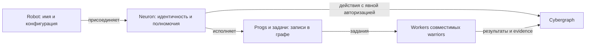

# Neuron + cell: один субъект, полноценное исполнение

Этот документ задаёт одобренное решение и порядок реализации. Полная реализация
и миграция разрешены пользователем 2026-09-12. Фактический прогресс и проверки
ведутся в [implementation ledger](../audit/neuron-cell/implementation.md).
Итоговая сверка P00–P13, проверки миграции и границы собранных профилей —
в [release audit](../audit/neuron-cell/release.md).
Основание — обсуждение модели робота и [аудит всего локального ~/cyber](../audit/neuron-cell/README.md).
[Матрица репозиториев](../audit/neuron-cell/repositories.md) покрывает каждый обнаруженный
checkout; [карта изменений](../audit/neuron-cell/change-map.md) указывает исходные файлы.

## 1. Решение

**Объединить neuron и runtime-cell в одного субъекта — neuron. Сохранить и развить
исполнение, продолжения, восстановление и ограничения ресурсов из cell.**

Именованный robot присоединяет нужное количество neurons. Разные сети, ключи,
права и устройства остаются поддержаны. У neuron есть собственный `NeuronId`;
он может подписывать/авторизовать действия и исполнять программы. Присоединение
watch-only identity не требует программы, интерпретатора или запущенного процесса.

Для программы уже есть термин **prog** в [словаре](../specs/terms.md).
Prog, task, invocation, operation, checkpoint имеют адресуемые записи и собственные
жизненные циклы. Их идентификаторы обозначают данные и работу; они не создают
ещё одного субъекта с ключами. Остановка программы не уничтожает neuron.



Стрелка к prog означает принадлежность работы, а не новую иерархию личностей.
Один robot может работать с несколькими neurons; один neuron — с несколькими
программами и устройствами. Это не обязывает заводить neuron для каждой вкладки,
инференс-запроса, фоновой задачи или процесса.

| Вариант | Выигрыш | Цена / ограничение | Решение |
|---|---|---|---|
| Объединить субъект и публичный ID | Один выбор действующего субъекта, один контекст полномочий, проще история и UI | Нужна настоящая миграция данных; программа перестаёт называться отдельной личностью | Цель этого плана |
| Новый neuron поверх самостоятельного cell | Меньше первоначальных правок движка | Два ID, правила владения/делегации между ними, два жизненных цикла субъектов; реальный необходимый сценарий не установлен | Не вводить |
| Сохранить чистую библиотеку исполнения внутри neuron | Переиспользование движка, небольшой identity API без VM | Нужно соблюдать границы зависимостей | Часть первого варианта |

Отдельный субъект появляется, когда нужны его собственные полномочия и атрибуция.
Тогда создаётся/присоединяется другой neuron. Если нужны только независимые состояние,
запуск или отмена — достаточно prog/task/invocation.

## 2. Фундаментальные ограничения

1. Для смысла органов robot исходной точкой служат свежие определения cyb.
   Черновики `cyb/specs/architecture.md` и `neuron.md`, оставляющие два варианта,
   необходимо заменить принятым решением, а не цитировать как уже утверждённую иерархию.
2. [Execution model](../specs/execution-model.md) остаётся нормативным: machine,
   environment, proof profile, network и executor выбираются независимо.
   Neuron не равен warrior, worker, device или validator.
3. История — данные cybergraph, долговечность — bbg. Log показывает историю;
   tape задаёт представление потока. Новый neuron не заводит отдельную базу,
   канонический журнал, consensus или собственную систему хеширования.
4. Ward принимает решения о полномочиях; vault управляет секретами; mudra и
   профильные proof-компоненты реализуют аутентификацию. Neuron связывает контекст.
5. Foculus сохраняет владение порядком и finality. Commit исполнения, сигнал
   нейрона и финализация сети — разные события, даже когда относятся к одному ID.
6. Переименование не меняет экономику tok/tru, адреса пользователей, историю
   Bostrom/Cosmos, формат чужой сети или криптографические правила.
7. Этот план не включает fork хеша/Model B из других roadmap. Совместимость
   исходного codec фиксируется отдельно от нового имени типа.

## 3. Типы, идентичность и зависимости

### 3.1 Одна семантика ID

| Сущность / ссылка | Целевой смысл | Что недопустимо |
|---|---|---|
| `NeuronId` | Нативный идентификатор протокольного субъекта по явно заданному identity profile | `H(Birth)` выдавать за подтверждённый neuron |
| Ссылка на субъект | Identity domain + native ID; для внешней сети — её исходный тип/байты адреса | Превращать любой foreign address в нативный 32-байтный neuron |
| Network reference | Сеть назначения/исполнения, отдельная от identity domain | Считать transport endpoint или одинаковую bech32-строку достаточной идентичностью |
| Authority binding | Версия связи субъекта, ключа/доказательства, допустимых действий и средств подписи | Глобальный mutable `current_neuron` в библиотеке |
| Prog binding | Установка определённой версии программы и её состояния на neuron | Второй signing ID, `CellId` под новым названием |
| Task / invocation / operation / attempt | Стабильные ссылки на работу и причинность | Новый neuron на каждый дочерний запрос |
| Graph namespace / snapshot / checkpoint | Адреса данных и проекций | Автоматическое право подписывать от имени их адреса |
| Replica / worker / endpoint | Размещение, связь и evidence исполнения | Независимый экономический аккаунт по факту запуска процесса |

Один нативный neuron может отправлять сигналы в разные совместимые сети. Для
внешних протоколов их domain определяет собственные правила адресации. Ни сеть,
ни ключ, ни устройство не должны неявно подменять друг друга.

Сейчас `soft3/specs/terms.md` одновременно говорит `H(secret)` и `H(pubkey)`,
а mudra реализует `neuron_of(pubkey)` и domain-scoped derivation. До любых новых
write paths закрепить таблицу реально поддержанных identity profiles и тестовые
векторы. Существующие идентификаторы и подписи сохраняются. Новая proof-native
схема получает отдельный versioned contract; этот roadmap не утверждает её готовность.

Смена устройства/worker не меняет subject. Смена key binding сохраняет ID лишь
если профиль допускает и проверяет rotation/recovery. Для `ID = H(pubkey)` новый
pubkey обычно означает новый ID; связь преемственности — явное доказательство,
а не перезапись старого автора. Detach от robot не удаляет протокольную identity.

### 3.2 Один repository, несколько небольших crates

Развивать существующий `cell` с сохранением Git-истории в repository `neuron`.
Не создавать параллельный identity repository, который навсегда оборачивает cell.

| Целевая crate | Источник | Ответственность |
|---|---|---|
| `neuron-id` | Низкоуровневые определения ID, сейчас bbg и re-exports | Минимальный общий тип/байтовый контракт; без runtime, storage, GUI, crypto implementation |
| `neuron-model` | `cell/model` + согласованная часть cyb neuron proposal | Subject/binding/prog/transition records, bounded readers, порты |
| `neuron-engine` | `cell/engine` | Admission, durable execution, continuation, recovery, budgets, effects |
| `neuron-rune` | `cell/rune` | Адаптер Rune, codec/checkpoint compatibility |
| `neuron-node` | `cell/node` | Композиция engine с cybergraph/bbg, ward и execution adapters |
| `neuron-cli` | `cell/cli` | Headless import/inspect/run/resume/migrate, явные subject/network |

Минимальная `neuron-id` нужна, чтобы bbg не зависел от runtime и его proof/storage
зависимостей. Это crate внутри того же repository, не новый компонент-субъект.
Начать с сохранения текущего байтового контракта и совместимых re-exports.
Переход от alias к строгому newtype рассматривать как отдельную API-правку,
без изменения serde, hashing и wire bytes.

```text
neuron-id ← bbg / foculus / нужные identity consumers
neuron-id + nox/hemera data ← neuron-model ← neuron-engine
neuron-engine + rune ← neuron-rune
neuron-engine + adapters + cybergraph/bbg ← neuron-node
neuron-node ← cyb / CLI / headless agent
```

Стрелки означают «используется справа». Проверяется граф **crate**-зависимостей,
а не количество взаимных ссылок между repository. Bbg не импортирует
`neuron-model`, engine или node. Watch-only consumer и lytics не тянут Rune,
Bevy, inference, scheduler или storage из-за импорта ID/подписи.

## 4. Исполнение: что действительно нужно изменить

### 4.1 Несколько программ и задач у одного neuron

Текущий движок допускает одно живое выполнение и один unresolved act на cell;
reader ограничивает карты, writer заменяет continuation/outbox. Удаления `Busy`
недостаточно. Требуется версия модели с картами prog bindings и invocations.

Минимальная цель:

- Два progs одного neuron выполняются независимо в пределах общего бюджета.
- Один prog принимает несколько задач. Зависшие внешние операции одной задачи
  не блокируют независимую работу всего neuron.
- У каждого invocation закреплены prog revision, вход, context, resources,
  authority binding и ссылки на продолжения/операции.
- Mutable состояние принадлежит конкретной установке prog; общие данные neuron
  изменяются через проверяемые переходы. Повторные установки одного кода различимы
  как записи конфигурации, без новых ключей.
- Много worker jobs исполняются одновременно, authoritative state commits
  упорядочены. Начальная политика — сериализовать изменения одного prog state;
  параллельные вычисления применяют результат только к совместимому state revision.
- Stale result становится конфликтом/новым входом. Чистое вычисление можно
  пересчитать по объявленной политике; внешний эффект нельзя повторять ради rebase.
- Child budgets резервируются из parent/neuron лимитов атомарно; рестарт,
  отмена и fan-out не создают ресурс заново. Справедливая очередь и backpressure
  исключают starvation и бесконечный inbox.

Цель не требует нескольких независимых public chains одного neuron.
Prog state и invocation IDs обеспечивают нужную декомпозицию работы.

### 4.2 Worker и авторизация

Engine сохраняет логическое продолжение и выдаёт bounded job в совместимый
worker существующей execution architecture. Он не реализует второй VM dispatcher.
Remote/embedded worker получает ровно нужный input и authority reference;
секреты не сериализуются в checkpoint и не отправляются вместе с программой.

Перед dispatch сохраняется operation/attempt с привязкой:
subject, caller/prog/invocation, binding revision, сеть назначения, точный payload,
policy/grant, executor contract, retry/finality, budget и idempotency key.
Переключение neuron в UI не меняет эти поля. Возобновление проверяет отзыв прав.
Смена автора, сети или смысла операции создаёт новое решение, а не редактирует
старую попытку. Действие через другой присоединённый neuron требует явной
делегации/выбора соответствующего subject; программа не получает весь robot vault.

Сначала поддержать одного локального writer. Два устройства могут читать и
исполнять вычисления, но право commit/dispatch должно быть fenced: устаревший
writer не может выпустить вторую авторизованную попытку. Распределённый профиль
выпускается только после контракта fencing/order в cybergraph/foculus/ward.
CRDT синхронизация данных сама по себе не решает equivocation или double spend.

### 4.3 Graph session вместо старого cyb Cell

`cyb/core/src/cell.rs` и его копия в `cyb/crates/cyb/src/cell.rs` держат общий
Cybergraph и цепочки многих neurons. Их целевая роль — `GraphSession`/адаптер
локального графа. Это объект приложения, без собственной signing identity.

Вынести необходимое общее durability/API поведение в cybergraph, оставить
cyb-specific composition в cyb. Удалить дублирование двух реализаций. Потребители
`SharedCell` получают shared graph/session и **явный** subject для действия.
Не заменять весь объект `Cell` на `Neuron`: иначе граф с несколькими аккаунтами
окажется ошибочно «одним нейроном».

Во время подготовки плана появились `cybergraph/specs/native-storage.md` и
`soft3/specs/native-node.md`: уже выделяется native coordinator над общей BBG
Database. P04 должен опираться на этот контракт и реально доступную к началу
пакета реализацию. Не создавать ещё один coordinator или конкурирующий log
importer. Наличие spec/module declaration само по себе не доказывает готовность.

Существующий tape signal log действительно является хранилищем в старом коде,
а `commit` игнорирует ошибку записи после изменения памяти. При переносе:
сначала надёжная транзакция/однозначный результат её разрешения, затем публикация
успеха. Импорт старого log сохраняет sig bytes, chain ordering и ошибки повреждения.
Log орган остаётся представлением; legacy log reader — средство импорта.

## 5. Миграция состояния и истории

### 5.1 Не переименовывать immutable bytes

`cell/model/schema-suite-v1.txt` участвует целиком в вычислении schema identities.
Все старые `cell/*/1`, birth/commit/operation IDs, checkpoint codecs и particle hashes
сохраняются. Reader старой suite остаётся в явно ограниченном legacy-модуле.
Новые записи получают новую suite; её encoding фиксируется в specs до writer.

| Старое | Новое | Правило переноса |
|---|---|---|
| `CellId = particle(Birth)` | Legacy origin reference + авторизованный `NeuronId` | Не приводить один ID к другому; хранить доказуемую связь |
| Definition / release | Prog code/revision | Сохранить код, артефакты, entry schema и hashes |
| Birth / parent | Активация prog и происхождение | Старое рождение остаётся фактом истории, не созданием ключа |
| Один snapshot | Prog state + invocation/operation records под neuron | Сохранить все live/terminal записи и policy |
| Cell head/index | Legacy head + новая commit lineage | Не пересчитывать старые цепочки и не путать с Signal.step |
| Event origin + nonce | Versioned admission claim | Повтор входа после миграции не допускается заново |
| Continuation | Invocation continuation | Codec/runtime revision либо совместимы, либо состояние остаётся suspended |
| Outbox / attempt / outcome | Сохраняемые записи эффектов | Сохранять idempotency, неопределённость, evidence и consumed_by |
| Charged / reserved / used | Остатки бюджета prog/invocation/neuron | Зарезервированное не становится свободным при импорте |
| Local owner policy | Legacy local provenance + новый grant | Не приписывать прошлому криптографическую подпись нового neuron |
| Retirement | Остановка/снятие prog | Не удалять neuron, деньги, независимые задачи и историю |

### 5.2 Mapping задаётся явно

План импорта содержит `legacy namespace → subject + prog binding + source head`.
Несколько старых cells разрешено перенести на один neuron, сохранив отдельные
prog states и ссылки на исходные истории. Нельзя слить namespaces простым
`old_id → neuron_id`: столкнутся heads, inbox, nonce claims и бюджеты.

Новый subject предоставляется владельцем/host через поддержанную аутентификацию.
У legacy local database нет доказанного ключа владельца; наличие файла не является
доказательством прошлой подписи. Без mapping и полномочий импорт только inspect/export,
записи остаются read-only. Если старая программа действовала через несколько
авторов, каждый action binding сохраняется либо требует явного разрешения;
выбор default neuron не переатрибутирует её историю.

### 5.3 Порядок инструмента migrate

1. **Inspect.** Версии, backend, доступность всех referenced artifacts,
   live invocations, unknown attempts, byte hashes, source heads, план mapping.
   Никакого dispatch. Отчёт содержит ошибки и оценку объёма/свободного места.
2. **Snapshot / fence.** Согласованный checkpoint и запрет конкурентных legacy
   writers; резервная копия штатным механизмом backend, не копированием открытых
   Fjall файлов. Зафиксировать epoch и migration manifest.
3. **Import data.** В существующий общий BBG Database, под staging records.
   Batches возобновляемы и идемпотентны; валидируются schema, hashes, references,
   authority mapping, claims и ресурсы. Не менять storage backend этой операцией.
4. **Validate.** Сравнить состояния, историю и ресурсы; повреждения карантинировать.
   Не считать отсутствующий артефакт пустым состоянием. Установить совместимость
   checkpoint и поддержанного worker, иначе оставить paused.
5. **Activate atomically.** Только после валидации переключить authoritative
   mapping/head и fencing. Не требуется одна гигантская транзакция для всего
   архива; атомарен переход видимости и прав writer.
6. **Reconcile / resume.** Неопределённые attempts сначала сверяются с executor
   receipts/idempotency semantics. Нет общего обещания exactly-once для чужого API.
   Неисполняемые старые checkpoints доступны для чтения/экспорта, не сбрасываются.
7. **Retire compatibility.** Прекратить старые writers; immutable history reader
   остаётся. Удаление источника — отдельная политика retention после проверки.

Повторный запуск после любого шага даёт тот же mapping и не повторяет effects.
До активации откат удаляет/игнорирует staging. После новых авторизованных записей
или dispatch простой запуск старого writer запрещён: нужен forward recovery
или новая согласованная миграция. Не обещать безусловный downgrade.

Существующий перенос redb → общий BBG/Fjall — отдельный инструмент. Его порядок
и результаты сохраняются; neuron migration не возвращает отдельную redb-базу.
Публичная публикация старой частной истории не является частью импорта.

## 6. Все значения cell: точная замена

| Найденный смысл | Целевая терминология / действие |
|---|---|
| Stateful runtime subject | Neuron; загруженная способность — prog; выполнение — invocation |
| `cyb_core::Cell`, `SharedCell` | Graph session / shared graph handle, без нового subject ID |
| Rune `run_cell` | `run_prog` либо точное имя event driver; сохраняется поведение |
| Rs `cell!`, `Cell`, `CellMetadata` | `module!`, `Module`, `ModuleMetadata`: bounded OS module с lifecycle/codegen, без signing identity. При установке исполняемого модуля на neuron он реализует prog contract |
| UI `cell://`, launcher, active/pinned cell | Типизированная цель навигации: neuron, prog, particle или view. Исторические URI разрешать через явный compatibility resolver |
| Node mode `full / cell / light` | `full / partial / light`: partial означает локальный срез графа. Сохранить verification/completeness обязанности и диагностику |
| Knowledge-cell / spectral division | Graph shard/region. Split/merge меняет topology/state placement; не создаёт subject или ключ автоматически |
| Root cell | Root shard / coordination region, с прежними routing/proof обязательствами |
| Building-cell | Service/prog; если сервис действует от собственного имени — service neuron с объявленной authority policy. Здание/площадка остаётся пространством |
| Ledger-cell / oikos household | Ledger/book данных под issuer/governance authority; имеющий собственную субъектность issuer — neuron. Token namespace не равен подписанту |
| 3c | Сохранить read/write/trade by proof/condition между объявленными участниками и scopes; развести author, ledger, shard, routing и finality |
| Nox `Noun::Cell`, substrate constructor | `Data::Pair` по отдельному terms roadmap; не `Neuron` |
| Rust `Cell`, `RefCell`, `OnceCell`; WASM stack; unimem; DAS/grid | KEEP: иной технический смысл |
| DOM/table/spreadsheet/draw.io cells; biology; battery/fuel cells | KEEP |
| Upstream Nockchain/Nushell/Bevy/iroh/OMI и vendored code | KEEP их API и vocabulary; мигрировать собственные adapters при необходимости |
| Immutable tags, signed data, исторические audits/публикации | Сохранить; добавить ссылку/alias на актуальный контракт, не переписать свидетельство |

Модель «все четыре ступени cell — один субъект» снимается. У topology, governance
и исполняющего субъекта разные роли. При этом функциональность 3c, regional
proofs, oikos и разделения графа не удаляется. До изменения соответствующих
спецификаций нужна таблица прежних инвариантов и их нового владельца.

## 7. Проверка по органам robot

Матрица исходного скана следовала 22 предметным файлам `cyb/parts` (включая старый cells).
Названия и роли сверены с актуальной anatomy при миграции 2026-09-13: проги —
исполняемые способности, brain — графовое представление, memory — файловая
проекция, plan — планирование. Это проверка функций; число standalone repositories
не является целью. Старый cells.md сохраняется как compatibility landing.

| Орган / функция | Отношение к neuron после объединения | Правка / проверка |
|---|---|---|
| name | Имя robot и graph names | Attach/detach не меняет имя robot |
| avatar | Представление robot/субъекта | Не обозначать процесс или root neuron |
| soul | Версионированная конфигурация | Pin revision при admission; убрать root-neuron ontology soma |
| body | Устройства и ресурсы | Один neuron на нескольких devices, один body для нескольких neurons |
| sigma | Обзор identities, holdings и действий | Registry + явный выбор subject/network; суммы из протокола |
| vault | Secret/key operations | Scoped access по binding, без ключей в execution records |
| ward | Полномочия | Grant/revocation на точное действие, в том числе после restart |
| prog (бывший cells) | Исполняемые способности | Заменить описание на progs нейрона; самостоятельный cell subject убрать |
| soma | Стратегия, tasks/goals, learning | Дочерняя работа не создаёт neuron автоматически |
| brain | Представление графа | Отображать scoped graph/provenance; inference принадлежит glia под стратегией soma и привязан к invocation |
| memory | Файловая проекция знания | Scope по субъекту и задаче; authoritative history в графе; выбор контекста принадлежит soma |
| state | Представление состояния | Различать neuron/prog/task и local/finalized state |
| log | Представление истории | Показывать автора, происхождение, операции, неопределённость; не новая БД |
| plan | Планы и расписания | Версии, шаги и durable triggers под task; nonce occurrence сохраняется после restart |
| time | Временное представление | Показывать причинный порядок/время без смешения runtime index, network step и finality |
| sense | Входные события | Source, subject, nonce, disclosure и causation сохраняются |
| now | Выбранный смысловой контекст | Переключение UI не меняет уже принятый invocation |
| com | Команды и диалог | Явные destinations; steering на safe boundary |
| radio | Связь и обнаружение | Endpoint отдельно от identity и полномочий |
| fs | Рабочие пространства | Scoped access, revision/workspace binding, история patch author |
| vision | Визуальное восприятие | Input artifacts и disclosure под task |
| voice | Голосовой ввод/вывод | Те же admission/effect правила, прерывание не теряет задачу |

Репозиторий neuron объединяет ID/model/runtime. Он не поглощает все органы.
Самостоятельное выделение ward/vault решается их контрактами, без зависимости
от существования cell. В UI не добавлять орган только ради сохранения числа 22.

## 8. Спецификации до реализации

| ID | Артефакт | Содержание и критерий готовности |
|---|---|---|
| S01 | `cyb/specs/architecture.md`, `neuron.md` | Одна модель robot/neuron/prog; убрать competing options и самостоятельный CellId |
| S02 | `soft3/specs/terms.md`, будущий `specs/neuron.md` | Subject/domain/network, prog, действие; согласовать с execution-model и authority owners |
| S03 | В будущем `neuron/specs/identity.md`, API | Матрица identity profiles, rotation, watch-only, foreign accounts, реэкспорты ID без wire fork |
| S04 | Переработанные `cell/specs/model.md`, data/api/lifecycle/execution | Prog/invocation maps, state conflict policy, cancellation/upgrade/recovery, budgets |
| S05 | Authority/communication/evidence/integration | Action binding, ward/vault, worker dispatch, fencing и честные локальные/сетевые guarantees |
| S06 | History/evolution + отдельная migration spec | Legacy suite, mapping, этапы импорта, crash/rollback/retention, неизвестные effects |
| S07 | Agent/evaluation/conformance | Сохранённые требования агента, исполнимые acceptance scenarios, совместимые профили |
| S08 | Cyber cell/hierarchy/3c/node-modes, aos/oikos | Subject vs service/ledger/shard; полная карта прежних обязанностей |

Текущие `cell/specs/foundations.md`, local-runtime.md и README также переписываются
под этот контракт. Существующий docs/cell-convergence сохраняет историю решения
с явной ссылкой на successor, вместо вида «старое всегда означало neuron».
Не объявлять старые draft proof/finality разделы реализованными после смены имени.

## 9. Пакеты работ и порядок поставки

Каждый пакет заканчивается reviewable изменением и evidence в audit владельца.
Список файлов и всех repository dispositions — в [change map](../audit/neuron-cell/change-map.md)
и [inventory](../audit/neuron-cell/repositories.md). `P` — пакет, `G` — release gate.

| ID | Работа / владелец | Зависит от | Результат и gate |
|---|---|---|---|
| P00 | Baseline, soft3 + владельцы | — | Обновить scan/HEAD/dirty; зафиксировать compatibility vectors, legacy DB fixture, dependency graph. G01 |
| P01 | Foundation decision, cyb + soft3 | P00 | S01–S03; согласованные identity/ownership rules. G02 |
| P02 | Data/execution/migration specs, cell | P01 | S04–S07; точные wire/transition contracts, P05–P07 реализуемы без догадок. G03 |
| P03 | `neuron-id`, model API и package names | P01, P02 | Малый ID crate/re-exports, чистая dependency DAG; существующий engine сохранён. G04 |
| P04 | Graph session и durability, cybergraph/bbg/cyb | P02, P03 | Общий API без Cell subject, корректные ошибки commit, reader старого signal log. G05 |
| P05 | Prog/invocation execution, neuron-engine/rune | P02, P03 | Несколько задач, state conflict policy, budgets, cancellation/restart. G06 |
| P06 | Subject/ward/vault/worker binding, neuron-node + cyb | P03, P05 | Настоящий supported auth, immutable operations, fencing локального writer. G07 |
| P07 | Legacy importer + new suite, neuron | P04, P05, P06 | Inspect/import/validate/activate/reconcile; old reader, resumable migration. G08 |
| P08 | Robot UI + prysm + CLI/neural | P04–P07 | Attach registry, typed navigation, explicit author/network, history views. G09 |
| P09 | Soma + headless agent composition | P05–P08 | Tasks/goals/context use neurons/progs; восстановление полного tool round-trip. G10 |
| P10 | SDK/действующие consumers | P03, P04, P06 | lytics, cyberia-my, trisha, soft3/js и legacy adapters сохраняют native identities. G11 |
| P11 | Domain ladder и документация | P01, S08 | Cyber/aos/crystal/cybics/cyberia: роли и ссылки без лишних субъектов. G12 |
| P12 | Packaging, registry, generated docs/context | P08–P11 | Repository/path move, CI/scripts/service docs; regenerate ctx/site; compatibility manifest. G13 |
| P13 | Integrated release audit | P07–P12 | Проверены gates, миграция rehearsal, scoped legacy allowlist; отчёт фактов. G14 |

P04 и P05 могут готовиться независимо после общего data contract. P11 может
идти вместе с runtime работой. Публикация схем и переключение writers происходят
по согласованному manifest; нельзя обновить только CLI или только новую suite.

В P05 также входит Rs macro/runtime boundary: `rs/core`, `rs/macros`, compiler
diagnostics, examples и tests. Сохранить hot-swap, state migration и bounded-async
декларации как возможности модуля; они не заменяют durable continuation/effects
движка neuron. Deadline wrapper сам по себе не доказывает enforcement executor.
Временный compiler alias `cell!` допускается по той же политике удаления, что API shim.

Практический первый implementation slice: P01–P03 и один end-to-end тест
«существующий neuron → prog → bounded run → checkpoint → restart». Затем P04–P07,
прежде чем масштабировать UI. Нельзя объявить merge завершённым после rename crate.

### Gates

| Gate | Проверяемое условие |
|---|---|
| G01 | Все discovered repositories имеют disposition; source gaps названы; baseline не основан на старых roadmap counts |
| G02 | Нет второй runtime subject identity в актуальном контракте; robot/network/device/prog примеры непротиворечивы |
| G03 | Для каждого нового record есть codec/validation/migration правило; immutable v1 vectors зафиксированы |
| G04 | ID/identity consumer собирается без VM/GUI; crate graph ацикличен; native IDs/signatures побайтно прежние |
| G05 | Commit failure не даёт false success; старый log корректно импортируется; multi-neuron graph/session работает |
| G06 | Два progs/несколько tasks одного neuron; suspended tool не блокирует независимую работу; budgets переживают restart; stale result не портит state |
| G07 | UI subject switch, grant revocation, wrong network и stale writer не меняют авторство и не выпускают лишний эффект; secrets отсутствуют в artifacts |
| G08 | Fixture: несколько old cells → один neuron; no state/claim/history loss; unknown attempt не повторяется; crash на каждом migration boundary возобновляем |
| G09 | Один robot: два ключа/две сети, watch-only identity и два устройства; навигация к prog/page не создаёт account; log показывает legacy provenance |
| G10 | Tool→suspend→restart→result→completion, parent/child join, cancel/steer, смена context/model, recovery расписания проверены через composition |
| G11 | lytics/domain signing, cyberia-my, trisha и legacy SDK vectors прежние; no runtime transitive weight для identity-only clients |
| G12 | Shard split, ledger authority, service governance и full/partial/light сохраняют прежние заявленные обязанности; biological/VM cells не изменены |
| G13 | Старые runtime package/API/CLI/config/URI references остались только в явном compatibility allowlist; source aliases и regenerated output согласованы |
| G14 | Совместимые revisions/feature sets зафиксированы; все предыдущие gates имеют evidence либо release явно ограничен неготовым профилем |

Тесты находятся у владельцев: engine state-machine/recovery; node/storage fault
injection; mudra/signature vectors; cyb/prysm UI integration; soma task scenarios.
Soft3 conformance связывает их fingerprint/release manifest. Существующий
conformance scaffold не считается готовой проверкой и не требует изобретать
отдельный универсальный test framework для этого merge.

## 10. Репозитории, публикация и совместимость

- Локальный directory move `cell → neuron` и remote repository rename — разные
  операции. Сначала согласованный код/manifest; перенос с сохранением `.git`,
  веток, рабочих изменений и проверкой занятости target. Не создавать пустой дубль.
- Проверить package names, workspace paths, lockfiles, CI, examples, install docs,
  service units, MCP/CLI command registries и ссылки. Path-зависимости разных
  repository должны собираться в одном совместимом checkout set.
- При независимых релизах временный API/CLI shim допустим, если делегирует новому
  коду и не создаёт CellId. У него явный срок удаления/следующий compatibility release.
  Legacy wire reader и доказанная история могут сохраняться бессрочно.
- Работающие подписи и контракты lytics/Cosmos/CosmWasm/Neptune не переписываются.
  Обновляются adapters и naming там, где они действительно потребляют новый API.
- Нельзя массово исправлять generated build copies, vendored sources, исторические
  audits или параллельные worktrees. Меняется source owner; копии регенерируются
  штатным publish/build процессом после проверки aliases и source revisions.
- `ctx/ctx.md` — производный bundle. Исправить generator inputs/pinned paths и
  перестроить после canonical docs; записать provenance, а не редактировать текст вручную.
- Перед каждым пакетом повторно проверить Git status: исходный скан не atomic
  snapshot всей машины, в workspace идёт другая работа. Не сбрасывать dirty files.

## 11. Связь с полноценным агентом

Merge снимает конфликт субъектов перед портированием Hermes. Сохраняются все
требования `cell/specs/agent.md` и evaluation: persistent tasks, context manifests,
tool adapters, inference, disclosure, schedules, delegation, memory и learning.
Их owning components остаются soma/brain/ward/vault/body/time/etc.

В P09 нужна матрица «agent requirement → owner → исполнимый scenario → evidence».
Hermes revision для сравнения фиксируется в отдельном agent roadmap; этот локальный
аудит не является новым аудитом Hermes upstream и не доказывает feature parity.
Полный перенос агента включает ещё providers/tools/integrations и эксплуатацию.
Финал этой работы — единая модель neuron с сохранённым и проверенным durable
execution, на которой такой агент можно последовательно достроить.

## 12. Что фиксируется до соответствующего write path

Открыты **детали контрактов**, а не необходимость второго субъекта:

| Вопрос | Рекомендованная исходная граница | Где закрыть |
|---|---|---|
| Native identity profiles | Сохранить реально работающие derivation/sign bytes; proof-native отдельно versioned | S03 / G04 |
| Foreign subjects | Native domain/address representation + явный target network | S02–S03 / G09 |
| Concurrent shared state | Serial commit одного prog; stale result проверяется; независимые jobs параллельны | S04 / G06 |
| Cross-device writes | Один fenced writer сначала; remote profile требует protocol evidence | S05 / G07 |
| Legacy owner mapping | Явная авторизация и manifest; inspect-only без неё | S06 / G08 |
| Service/ledger/shard governance | Сохранять роли, proofs и finality; subject выделять лишь для собственных действий | S08 / G12 |

Изменение исходной рекомендации оформляется через конкретный сценарий и его
последствия для схем, migration и gates. Возвращение CellId ради удобства текущего
движка не является закрытием этих вопросов.
