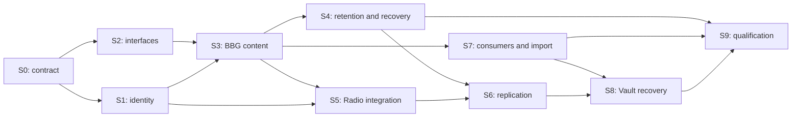

# storage delivery project

Deliver one storage system for the stack: canonical file identity, all durable
bytes in BBG, Radio as transport, and recovery that survives process and device
loss under an explicit replication policy. Vault is the first full integration;
public files, Cyb content, application history and large artifacts qualify the
same interfaces.

[Architecture](../../specs/storage.md) ·
[[bbg/specs/content-storage|BBG contract]] ·
[Identity decision](identity.md) · [Acceptance matrix](acceptance.md) ·
[Baseline audit](../../audit/file-storage-2026-09-24/README.md)

## committed direction

- Upgrade the existing Radio and preserve useful transport behavior.
- Persist payloads, partial transfers and recovery metadata through BBG in every
  deployment. Select Fjall/SSD or redb/HDD at the Database owner.
- Give every file one canonical particle across the stack. Retire Radio's
  competing BAO identity through a verified migration.
- Use bounded operations and paged structures with no arbitrary total file,
  library or revision cap.
- Keep private persistence separate from public graph disclosure.

The algorithm/input definition of particle is pending S1. The interfaces in
the specs are behavioral contracts; concrete API signatures are pending S2.
Runtime conformity is pending the work packages below. Existing backend
reliability work in [[bbg/roadmap/storage-reliability]] remains a prerequisite
for declaring the node reliable.

## dependency order

S2 and storage preparation can advance against an injected verifier while S1
is researched. Canonical identity freeze, public transport cutover and claims
of verified partial delivery require S1. S9 evidence is collected throughout,
with final qualification after the dependent paths converge.

## work packages

Status vocabulary: documented, decision required, planned, implementing,
blocked, qualified. A package becomes qualified only with linked evidence for
its exit criteria. Repository names identify implementation ownership.

| ID | owner repositories | status | depends on | deliverable and exit criteria |
|---|---|---|---|---|
| S0 | soft3, bbg | documented | — | Shared ownership and local persistence contracts, navigable indexes and this tracker; runtime qualification remains separate |
| S1 | hemera, file, lens, nox; soft3 coordinates | decision required | S0 | Close [identity questions](identity.md); one normative construction, reference implementation and cross-component vectors including authenticated ranges |
| S2 | bbg, cybergraph, foculus, radio | planned | S0 | Specify and exercise source/sink, coverage, publication, retention and receipt interfaces; ownership/dependency map; no network inside storage transactions or Radio-owned persistence |
| S3 | bbg, cybergraph | planned | S1, S2; existing BBG reliability gates | Streamed parts, paged descriptors/coverage, crash-safe seal and bounded atomic publication on both profiles; A1–A4 |
| S4 | bbg, cybergraph | planned | S3 | Durable retention roots, active read protection, resumable GC, history traversal and device migration; A3, A5, A8 |
| S5 | radio, hemera, foculus | planned | S1, S2, S3 | Existing Radio uses injected BBG sources/sinks; authenticated ranges and resume; all filesystem/DB ownership accounted for; remove obsolete BAO/store path only after migration; A1, A4, A10 |
| S6 | foculus, cybergraph, radio, bbg | planned | S4, S5 | Authenticated replication obligations and complete durable acknowledgements; explicit failure domains, retry, partition and stale-replica handling; A6, A7 |
| S7 | file, cybergraph, cyb, neuron, cyber, soft3 | planned | S3, S2 | Consumers share content/history APIs; import existing JSONL, application blobs and Radio stores; exact-byte validation, provenance and resumable reconciliation; A8, A10, A11 |
| S8 | vault, mudra, neuron, cybergraph, foculus | planned | S6, S7 | Existing sealed-record semantics over the generic service; device-loss restore, protected-use state and freshness/fencing; A6, A7, A9 and Vault conformance |
| S9 | soft3, all owning repositories | planned | S4, S5, S6, S7, S8 | Cross-consumer/profile acceptance, measured scaling, privacy review and pinned release evidence; A1–A11 |

S7 import code may develop earlier; imported identities remain explicitly legacy
until S1 defines their relation to the canonical representation. Old references
are never silently relabeled. Consumer migration must eliminate parallel writers
before the old path is retired.

S7 replaces Cyb's standalone JSONL writer and removes TextArchive's whole-history
materialization and total-projection assumptions through the shared paged
service. Preserve import visibility and retry semantics. The baseline audit
provides the pinned source paths; cosmetic adapter wrapping cannot close this
package while an independent writer or total-history cap remains.

## interface map for S2

| boundary | carries | persistent owner |
|---|---|---|
| File / application → Cybergraph | Namespace, content stream, expected head, request identity, retention intent | BBG through validated application operations |
| Cybergraph → BBG | Parts, verified closure, conditional publication, receipts and retention | Shared Database owner |
| Foculus → BBG | Missing-range queries, staged arrivals, sync jobs and replica obligations | Shared Database owner |
| Foculus → Radio | Authorized transfer session, requested particle/ranges, source/sink handles and cancellation | BBG for resumable state; bounded transient Radio buffers |
| BBG / Radio adapters → Hemera verifier | Canonical descriptor, bytes, range proof and expected particle | BBG for retained proof/coverage state |

Specify cancellation, errors, backpressure, ownership of returned buffers,
authorization scope and commit-unknown propagation for every boundary. A remote
receipt is issued by the authenticated storage service after retention commits.
Host-provided transport credentials retain their existing endpoint identity
semantics and custody boundary; upgrading storage grants no neuron authority
to a Radio peer or session key.

## Radio extraction ledger

| area to inspect | target responsibility | completion condition |
|---|---|---|
| Blob database, data/outboard files, tags, temporary pins, partial progress and GC | BBG content/retention service | All durable writes accounted for and migrated; Radio runs without its own storage directory |
| Competing file hash and BAO verification | Canonical Hemera identity/proof interface | S1 vectors pass through the actual transfer path; no unchecked auxiliary root |
| Application reconciliation in iroh-docs / iroh-willow | Foculus or an explicitly scoped protocol adapter | Each live caller mapped; duplicate engine retired after behavior parity |
| Application framing | Selected shared framing contract | Protocol/schema agreement with bounded decoding and compatibility tests |
| QUIC, relay, discovery, connection state, transport handshake | Radio | Preserved transport behavior; no unreviewed crypto substitution bundled with storage extraction |

Inventory dependencies and live call paths before deleting code. Library size
alone does not establish duplication. The [component-boundary roadmap](../component-boundaries.md)
owns separate VDF, ordering and transport-crypto work.

## tracking and release evidence

Each implementation PR cites its S identifier and A acceptance rows. On progress,
update that row with PR/commit links and remaining criteria. Store reproducible
results in the owning repository's `audit/storage/`, including commands, full
revisions, backend/profile and failure-injection setup. Soft3 links the combined
receipt set and exact source closure in its release evidence.

A missing executable gate remains planned or blocked, never implicitly green.
Documentation status cannot promote a runtime package. A qualified release
includes migration results and restore evidence, alongside the inventory of
soft3 dependencies consumed by Cyber and Cyb.
